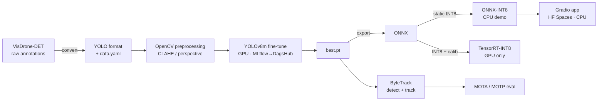

# Real-time Object Detection & Tracking Pipeline

End-to-end, reproducible **object detection + multi-object tracking** on
the [VisDrone](http://aiskyeye.com/) aerial dataset, with full MLOps and a
**zero-cost** public demo.

> Detection: **YOLOv8m** (Ultralytics) · Tracking: **ByteTrack** ·
> Optimization: **ONNX / ONNX Runtime + TensorRT INT8** ·
> Preprocessing: **OpenCV (CLAHE, perspective correction)** ·
> Tracking: **MLflow on DagsHub** · Demo: **Gradio on HuggingFace Spaces (CPU)**

---

## Why this project

A portfolio-grade pipeline that prioritizes **clean code, reproducibility,
honest metrics, and free-tier deployability**. Every GPU-only step (training,
TensorRT) is isolated into standalone scripts + notebooks so it runs on a
free Colab T4; the deployed demo runs entirely on CPU via ONNX Runtime.

## Architecture



## Results

> **Targets vs. measured.** Targets reflect the project goals; the
> "Measured" column is filled in **only** from real runs. `TODO` = run the
> corresponding GPU step and paste the value (see notebooks/).

### Detection (VisDrone-DET val)

| Metric          | Target | Measured |
|-----------------|:------:|:--------:|
| mAP@0.5         | ~0.87  | _TODO_   |
| mAP@0.5:0.95    |   —    | _TODO_   |
| Training time   | ~3 h (T4) | _TODO_ |

### Optimization (latency / size)

| Model         | Size (MB) | Latency (ms) | FPS | mAP@0.5 | Δ mAP |
|---------------|:---------:|:------------:|:---:|:-------:|:-----:|
| PyTorch FP32  |  _TODO_   |   _TODO_     |_TODO_| _TODO_ |  —    |
| ONNX INT8     |  _TODO_   |   _TODO_     |_TODO_| _TODO_ | _TODO_|
| TensorRT INT8 |  _TODO_   |   _TODO_     |_TODO_| _TODO_ | _TODO_|

Targets: ~68% size reduction, <1.5% mAP loss from INT8, ~30 FPS GPU tracking.

### Tracking (VisDrone-MOT)

| Metric | Target | Measured |
|--------|:------:|:--------:|
| MOTA   | ~0.74  | _TODO_   |
| MOTP   |   —    | _TODO_   |
| FPS (GPU) | ~30 | _TODO_   |

### Demo (HuggingFace Spaces, CPU 2 vCPU / 16 GB)

| Metric    | Target  | Measured |
|-----------|:-------:|:--------:|
| FPS (CPU) | ~3–4    | _TODO_   |

---

## Repository layout

```
object-detection-tracking/
├── configs/         # YAML: data, train, trackers, preprocess, paths
├── data/            # dataset (gitignored) + prep docs
├── src/
│   ├── data/        # download + VisDrone→YOLO convert + split + validate
│   ├── preprocessing/  # OpenCV CLAHE + perspective correction
│   ├── training/    # YOLOv8 fine-tune + MLflow→DagsHub
│   ├── optimization/   # ONNX export, INT8 quant, TensorRT, benchmarks
│   ├── tracking/    # ByteTrack + MOTA/MOTP eval
│   └── inference/   # unified preprocess→detect→track (video/webcam)
├── app/             # Gradio app for HF Spaces (CPU, ONNX-INT8)
├── notebooks/       # Colab training + TensorRT notebooks (T4)
├── tests/           # unit tests
├── scripts/         # CLI convenience wrappers
└── .github/workflows/  # CI: lint + tests
```

## Quickstart (local, CPU)

```bash
# 1. Install base deps (CPU)
python -m venv .venv && . .venv/bin/activate      # Windows: .\.venv\Scripts\Activate.ps1
pip install -r requirements.txt

# 2. Prepare the dataset (downloads several GB, resumable)
python -m src.data.download_visdrone --config configs/paths.yaml
python -m src.data.convert_visdrone  --config configs/paths.yaml
python -m src.data.validate_labels   --config configs/paths.yaml

# 3. Lint + test
ruff check . && black --check . && pytest -q
```

GPU steps (training, TensorRT) — see [`notebooks/`](notebooks/).

## Limitations & hardware notes

- **GPU required** for training and TensorRT INT8; both detect CUDA at
  runtime and fail with a clear message if unavailable. Use the provided
  Colab notebook (free T4).
- The **deployed demo is CPU-only** (ONNX Runtime, `CPUExecutionProvider`)
  and therefore slower (~3–4 FPS target) than GPU tracking (~30 FPS).
- Reported metrics are **targets**; measured values are populated from
  actual runs and may differ with hardware, epochs, and seeds.

## License

MIT — see [LICENSE](LICENSE).
