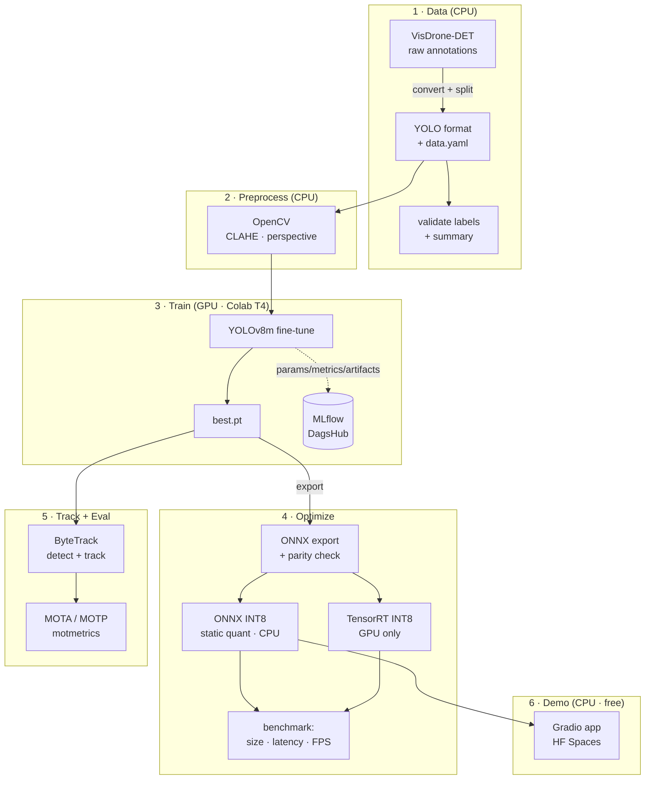

# Real-time Object Detection & Tracking Pipeline

End-to-end, reproducible **object detection + multi-object tracking** on
the [VisDrone](http://aiskyeye.com/) aerial dataset, with full MLOps and a
**zero-cost** public demo.

> Detection: **YOLOv8m** (Ultralytics) · Tracking: **ByteTrack** ·
> Optimization: **ONNX / ONNX Runtime + TensorRT INT8** ·
> Preprocessing: **OpenCV (CLAHE, perspective correction)** ·
> Tracking: **MLflow on DagsHub** · Demo: **Gradio on HuggingFace Spaces (CPU)**

---

## Why this project

A portfolio-grade pipeline that prioritizes **clean code, reproducibility,
honest metrics, and free-tier deployability**. Every GPU-only step (training,
TensorRT) is isolated into standalone scripts + notebooks so it runs on a
free Colab T4; the deployed demo runs entirely on CPU via ONNX Runtime.

## Architecture



The pipeline is split so every **GPU-only** stage (training, TensorRT) is
isolated; everything else — data prep, ONNX-INT8, tracking eval, and the
deployed demo — runs on **CPU**.

## Results

> **Measured results** from the completed runs below. Detection + training
> were on a Colab **A100-80GB**; optimization latency was measured on a Colab
> **T4** (TensorRT row) and **CPU** (PyTorch/ONNX rows) — see the per-table
> notes. Numbers are reported as-is from the runs, not idealized targets.

### Detection (YOLOv8m, VisDrone-DET val · 50 epochs, A100)

| Metric        | Measured |
|---------------|:--------:|
| mAP@0.5       | **0.435** |
| mAP@0.5:0.95  | 0.268    |
| Precision     | 0.552    |
| Recall        | 0.433    |
| Training time | ~47 min (50 epochs, Colab A100-80GB) |

Per-class mAP@0.5 (highlights):

| Class | mAP@0.5 | | Class | mAP@0.5 |
|-------|:-------:|-|-------|:-------:|
| car   | 0.830 | | motor          | 0.471 |
| bus   | 0.679 | | truck          | 0.410 |
| van   | 0.522 | | tricycle       | 0.341 |
| pedestrian | 0.458 | | people     | 0.337 |
|       |       | | bicycle        | 0.167 |
|       |       | | awning-tricycle| 0.140 |

VisDrone is a **hard small-object aerial benchmark** (tiny, densely packed,
heavily occluded objects from drone altitude), so an overall mAP@0.5 of
**0.435** is a reasonable result for a 50-epoch YOLOv8m fine-tune. The
profile reflects object size/frequency: large, common classes like **car
(0.83), bus (0.68), van (0.52)** score well, while small or rare classes
like **bicycle (0.17)** and **awning-tricycle (0.14)** are much harder and
drag the mean down.

### Optimization (size / latency / FPS)

| Model         | Size (MB) | Latency (ms) | FPS   | Measured on |
|---------------|:---------:|:------------:|:-----:|-------------|
| PyTorch FP32  |  52.0     |   317.6      |   3.1 | CPU |
| ONNX FP32     | 103.6     |   262.0      |   3.8 | CPU |
| ONNX INT8     |  26.5     |   434.7      |   2.3 | CPU |
| TensorRT INT8 |  30.4     |     4.2      | 240.7 | **T4 GPU** |

**Honest framing:** the PyTorch/ONNX rows are **CPU-measured**; the TensorRT
row is **T4 GPU-measured** — different hardware, so don't read the table as a
single apples-to-apples latency ladder. Two takeaways that *are* fair:

- **INT8 quantization shrinks the model 74.4%** (ONNX FP32 103.6 MB →
  ONNX INT8 26.5 MB). On this CPU (no VNNI/AVX-512 INT8 acceleration) INT8
  latency does **not** improve — ONNX INT8 is actually slower than FP32 — so
  the CPU INT8 win here is purely **size**, not speed.
- **TensorRT INT8 on the T4 is the real speed story: 240.7 FPS / 4.2 ms** —
  that's the GPU deployment path, where INT8 delivers both small size *and*
  large speedup.

### Tracking (VisDrone-MOT)

ByteTrack runs on top of the detector; the unified pipeline + MOTA/MOTP
evaluation script (`src/tracking/evaluate_mota.py`) are in place. MOT-val
sequence metrics are not yet transcribed here — run the eval on a
VisDrone-MOT sequence to populate this section.

### Demo (HuggingFace Spaces, CPU 2 vCPU / 16 GB)

The Gradio app runs the ONNX INT8 model on CPU via ONNX Runtime. Expected
throughput on the free tier is a few FPS (consistent with the CPU ONNX
latency above); the app prints the live FPS it actually achieves.

---

## Repository layout

```
object-detection-tracking/
├── configs/         # YAML: data, train, trackers (bytetrack/botsort), preprocess, paths
├── data/            # dataset (gitignored) + prep docs
├── src/
│   ├── data/        # download + VisDrone→YOLO convert + split + validate
│   ├── preprocessing/  # OpenCV CLAHE + perspective correction + viz
│   ├── training/    # YOLOv8 fine-tune + MLflow→DagsHub
│   ├── optimization/   # ONNX export+parity, INT8 quant, TensorRT, benchmark
│   ├── tracking/    # ByteTrack core + Kalman + MOTA/MOTP eval + Ultralytics path
│   └── inference/   # ONNX detector + unified preprocess→detect→track
├── app/             # Gradio app (app.py + demo_logic.py) for HF Spaces (CPU)
├── notebooks/       # train_colab.ipynb + tensorrt_int8.ipynb (T4)
├── tests/           # unit tests (CPU, no dataset/GPU needed)
├── scripts/         # CLI convenience wrappers (setup, prepare_data)
└── .github/workflows/  # CI: lint + tests
```

## End-to-end workflow

The pipeline runs in stages. Stages 3 and the TensorRT part of 4 need a
GPU (use the Colab notebooks); everything else is CPU.

### 0 · Install (local, CPU)

```bash
python -m venv .venv && . .venv/bin/activate      # Windows: .\.venv\Scripts\Activate.ps1
pip install -r requirements.txt
```

### 1 · Data (CPU)

```bash
# download (resumable, cached) -> convert to YOLO -> validate + summary
python -m src.data.download_visdrone --config configs/paths.yaml
python -m src.data.convert_visdrone  --config configs/paths.yaml --write-data-yaml
python -m src.data.validate_labels   --config configs/paths.yaml
```

VisDrone archive mirrors rotate; if a download 404s, grab fresh links from
[aiskyeye.com](http://aiskyeye.com/download/) and pass `--urls urls.yaml`,
or drop the zips into `data/raw/` and re-run to extract.

### 2 · Preprocess preview (CPU, optional)

```bash
python -m src.preprocessing.cli --image path/to/aerial.jpg \
    --config configs/preprocess.yaml --out outputs/preprocess_demo.jpg
```

### 3 · Train (GPU · Colab T4)

1. Open [`notebooks/train_colab.ipynb`](notebooks/train_colab.ipynb) in Colab.
2. *Runtime → Change runtime type → T4 GPU*.
3. Add a Colab secret `DAGSHUB_TOKEN`; set your DagsHub MLflow URI + username
   in the Config cell.
4. *Run all* (~3 h for 100 epochs). `best.pt` is saved to Drive.
5. Download `best.pt` → place it at `weights/best.pt` locally.

To set your DagsHub URI for the local script too, edit
`mlflow_tracking_uri` in [`configs/train.yaml`](configs/train.yaml) (or pass
`--mlflow-uri`). A 1-epoch CPU smoke test: `python -m src.training.train
--allow-cpu --epochs 1`.

### 4 · Optimize (CPU + GPU)

```bash
# CPU: export ONNX (with PyTorch<->ORT parity check) + static INT8 quantization
python -m src.optimization.export_onnx   --weights weights/best.pt
python -m src.optimization.quantize_int8 --model weights/best.onnx \
    --calib-dir data/yolo/VisDrone-DET/images/val --num-samples 200

# GPU only (Colab): TensorRT INT8 engine — see notebooks/tensorrt_int8.ipynb
# CPU/GPU: benchmark whatever models are present, write the README table
python -m src.optimization.benchmark --weights-dir weights --out outputs/bench.md
```

### 5 · Track + evaluate (CPU)

```bash
# unified detect+track on a video or webcam (0)
python -m src.inference.run --model weights/best.int8.onnx \
    --source clip.mp4 --save outputs/tracked.mp4 --no-show

# MOTA/MOTP on a VisDrone-MOT sequence
python -m src.tracking.evaluate_mota --model weights/best.int8.onnx \
    --seq-images data/raw/VisDrone2019-MOT-val/sequences/<seq> \
    --gt data/raw/VisDrone2019-MOT-val/annotations/<seq>.txt
```

### 6 · Demo (CPU, free Spaces)

```bash
pip install -r app/requirements.txt
MODEL_PATH=weights/best.int8.onnx python app/app.py
```

Deploy to HuggingFace Spaces — see [`app/README.md`](app/README.md) for the
Spaces header and two deployment options.

### Post-training checklist (run once `weights/best.pt` exists)

After the Colab run produces `best.pt`, place it at `weights/best.pt` and
run these CPU steps in order. Each is copy-pasteable; fill the printed
numbers into the README results tables.

```bash
# 1. Export to ONNX (opset 13, dynamic axes) + PyTorch<->ORT parity check
python -m src.optimization.export_onnx --weights weights/best.pt --imgsz 640
#    -> writes weights/best.onnx ; expect "[parity] ... -> PASS"

# 2. Static INT8 quantization (calibrate on real VisDrone val images)
python -m src.optimization.quantize_int8 \
    --model weights/best.onnx \
    --calib-dir data/yolo/VisDrone-DET/images/val \
    --num-samples 200 --imgsz 640
#    -> writes weights/best.int8.onnx ; prints the size reduction %

# 3. (GPU, optional) TensorRT INT8 engine — run in notebooks/tensorrt_int8.ipynb
#    python -m src.optimization.build_tensorrt --onnx weights/best.onnx \
#        --calib-dir data/yolo/VisDrone-DET/images/val --engine weights/best.int8.engine

# 4. Benchmark size / latency / FPS across the variants present
python -m src.optimization.benchmark --weights-dir weights --stem best \
    --runs 100 --out outputs/bench.md
#    -> prints + writes the Optimization table (run on GPU for the TensorRT row)

# 5. MOTA / MOTP on a VisDrone-MOT sequence
python -m src.tracking.evaluate_mota \
    --model weights/best.int8.onnx \
    --seq-images data/raw/VisDrone2019-MOT-val/sequences/<seq> \
    --gt data/raw/VisDrone2019-MOT-val/annotations/<seq>.txt
#    -> prints MOTA / MOTP / IDF1

# 6. Transcribe measured numbers into the README tables:
#    - Detection: mAP@0.5 / mAP@0.5:0.95 from the Colab training run (MLflow/DagsHub)
#    - Optimization: paste outputs/bench.md (size, latency, FPS); add mAP delta
#    - Tracking: MOTA / MOTP / FPS from step 5 (FPS from --runs on GPU)
#    - Demo: FPS reported by the Gradio app on Spaces
#    Replace every "_TODO_" with the real value; do not fabricate.
```

### Lint + test (CPU)

```bash
ruff check . && black --check . && pytest -q
```

## Limitations & hardware notes

- **GPU required** for training and TensorRT INT8. Both call
  `torch.cuda.is_available()` and fail fast with a clear message on CPU
  (training allows `--allow-cpu --epochs 1` for a smoke test only). Use the
  free Colab T4 notebooks for the real runs.
- The **deployed demo is CPU-only** (ONNX Runtime, `CPUExecutionProvider`,
  no torch/TensorRT). It runs at a few FPS on the free tier — far below the
  measured **TensorRT INT8 GPU throughput (240.7 FPS / 4.2 ms on a T4)** —
  and long videos are capped (default 300 frames) to fit the free tier.
- **Metrics are real, measured values, not idealized targets.** Detection
  mAP@0.5 is **0.435** (50-epoch YOLOv8m on VisDrone, A100); results vary
  with hardware, epoch count, seed, and confidence thresholds. VisDrone is a
  hard small-object aerial dataset, which is why strong classes (car/bus/van)
  far outscore hard ones (bicycle/awning-tricycle).
- **VisDrone download mirrors rotate.** The downloader supports resumable
  HTTP and Google Drive (`gdown`), but you may need to supply fresh links.
- The bundled **ByteTrack is a compact reimplementation** (pure NumPy + a
  Kalman filter, optional `lap` for assignment) so the CPU demo stays
  dependency-light. The `.pt` GPU path can instead use Ultralytics' built-in
  tracker via `configs/bytetrack.yaml` / `configs/botsort.yaml`
  (`src/tracking/ultralytics_tracker.py`).
- **TensorRT INT8 is GPU-only** and was measured on a Colab T4 (240.7 FPS);
  it cannot be measured on a CPU-only workstation — the benchmark marks that
  row by where it ran.
- Accessibility/UX of the Gradio demo is minimal; it is a technical
  showcase, not a production UI.

## Testing & CI

Unit tests cover the CPU-testable surface: VisDrone parsing/conversion,
label validation, preprocessing transforms, ONNX decode + NMS, the
ByteTrack association/Kalman logic, MOT ground-truth parsing, optimization
helpers, and the demo logic. GPU-dependent code paths (training, TensorRT)
are isolated and exercised in the notebooks instead.

```bash
pytest -q          # ~90 tests, no GPU or dataset required
ruff check . && black --check .
```

CI ([`.github/workflows/ci.yml`](.github/workflows/ci.yml)) runs lint +
tests on Python 3.10 and 3.11 for every push/PR.

## License

MIT — see [LICENSE](LICENSE).
