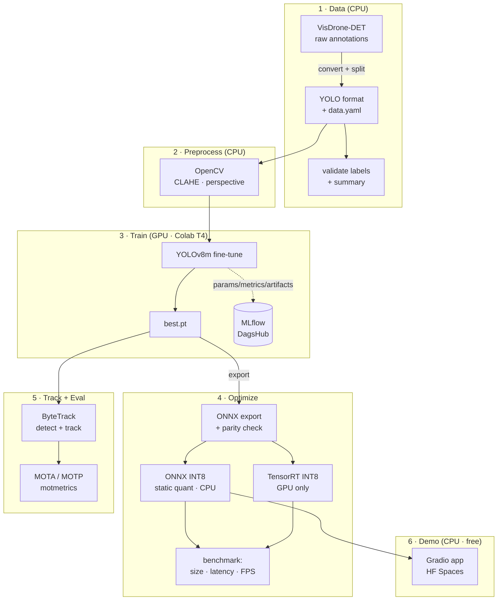

# Real-time Object Detection & Tracking Pipeline

End-to-end, reproducible **object detection + multi-object tracking** on
the [VisDrone](http://aiskyeye.com/) aerial dataset, with full MLOps and a
**zero-cost** public demo.

> Detection: **YOLOv8m** (Ultralytics) · Tracking: **ByteTrack** ·
> Optimization: **ONNX / ONNX Runtime + TensorRT INT8** ·
> Preprocessing: **OpenCV (CLAHE, perspective correction)** ·
> Tracking: **MLflow on DagsHub** · Demo: **Gradio on HuggingFace Spaces (CPU)**

---

## Why this project

A portfolio-grade pipeline that prioritizes **clean code, reproducibility,
honest metrics, and free-tier deployability**. Every GPU-only step (training,
TensorRT) is isolated into standalone scripts + notebooks so it runs on a
free Colab T4; the deployed demo runs entirely on CPU via ONNX Runtime.

## Architecture



The pipeline is split so every **GPU-only** stage (training, TensorRT) is
isolated; everything else — data prep, ONNX-INT8, tracking eval, and the
deployed demo — runs on **CPU**.

## Results

> **Targets vs. measured.** Targets reflect the project goals; the
> "Measured" column is filled in **only** from real runs. `TODO` = run the
> corresponding GPU step and paste the value (see notebooks/).

### Detection (VisDrone-DET val)

| Metric          | Target | Measured |
|-----------------|:------:|:--------:|
| mAP@0.5         | ~0.87  | _TODO_   |
| mAP@0.5:0.95    |   —    | _TODO_   |
| Training time   | ~3 h (T4) | _TODO_ |

### Optimization (latency / size)

| Model         | Size (MB) | Latency (ms) | FPS | mAP@0.5 | Δ mAP |
|---------------|:---------:|:------------:|:---:|:-------:|:-----:|
| PyTorch FP32  |  _TODO_   |   _TODO_     |_TODO_| _TODO_ |  —    |
| ONNX INT8     |  _TODO_   |   _TODO_     |_TODO_| _TODO_ | _TODO_|
| TensorRT INT8 |  _TODO_   |   _TODO_     |_TODO_| _TODO_ | _TODO_|

Targets: ~68% size reduction, <1.5% mAP loss from INT8, ~30 FPS GPU tracking.

### Tracking (VisDrone-MOT)

| Metric | Target | Measured |
|--------|:------:|:--------:|
| MOTA   | ~0.74  | _TODO_   |
| MOTP   |   —    | _TODO_   |
| FPS (GPU) | ~30 | _TODO_   |

### Demo (HuggingFace Spaces, CPU 2 vCPU / 16 GB)

| Metric    | Target  | Measured |
|-----------|:-------:|:--------:|
| FPS (CPU) | ~3–4    | _TODO_   |

---

## Repository layout

```
object-detection-tracking/
├── configs/         # YAML: data, train, trackers (bytetrack/botsort), preprocess, paths
├── data/            # dataset (gitignored) + prep docs
├── src/
│   ├── data/        # download + VisDrone→YOLO convert + split + validate
│   ├── preprocessing/  # OpenCV CLAHE + perspective correction + viz
│   ├── training/    # YOLOv8 fine-tune + MLflow→DagsHub
│   ├── optimization/   # ONNX export+parity, INT8 quant, TensorRT, benchmark
│   ├── tracking/    # ByteTrack core + Kalman + MOTA/MOTP eval + Ultralytics path
│   └── inference/   # ONNX detector + unified preprocess→detect→track
├── app/             # Gradio app (app.py + demo_logic.py) for HF Spaces (CPU)
├── notebooks/       # train_colab.ipynb + tensorrt_int8.ipynb (T4)
├── tests/           # unit tests (CPU, no dataset/GPU needed)
├── scripts/         # CLI convenience wrappers (setup, prepare_data)
└── .github/workflows/  # CI: lint + tests
```

## End-to-end workflow

The pipeline runs in stages. Stages 3 and the TensorRT part of 4 need a
GPU (use the Colab notebooks); everything else is CPU.

### 0 · Install (local, CPU)

```bash
python -m venv .venv && . .venv/bin/activate      # Windows: .\.venv\Scripts\Activate.ps1
pip install -r requirements.txt
```

### 1 · Data (CPU)

```bash
# download (resumable, cached) -> convert to YOLO -> validate + summary
python -m src.data.download_visdrone --config configs/paths.yaml
python -m src.data.convert_visdrone  --config configs/paths.yaml --write-data-yaml
python -m src.data.validate_labels   --config configs/paths.yaml
```

VisDrone archive mirrors rotate; if a download 404s, grab fresh links from
[aiskyeye.com](http://aiskyeye.com/download/) and pass `--urls urls.yaml`,
or drop the zips into `data/raw/` and re-run to extract.

### 2 · Preprocess preview (CPU, optional)

```bash
python -m src.preprocessing.cli --image path/to/aerial.jpg \
    --config configs/preprocess.yaml --out outputs/preprocess_demo.jpg
```

### 3 · Train (GPU · Colab T4)

1. Open [`notebooks/train_colab.ipynb`](notebooks/train_colab.ipynb) in Colab.
2. *Runtime → Change runtime type → T4 GPU*.
3. Add a Colab secret `DAGSHUB_TOKEN`; set your DagsHub MLflow URI + username
   in the Config cell.
4. *Run all* (~3 h for 100 epochs). `best.pt` is saved to Drive.
5. Download `best.pt` → place it at `weights/best.pt` locally.

To set your DagsHub URI for the local script too, edit
`mlflow_tracking_uri` in [`configs/train.yaml`](configs/train.yaml) (or pass
`--mlflow-uri`). A 1-epoch CPU smoke test: `python -m src.training.train
--allow-cpu --epochs 1`.

### 4 · Optimize (CPU + GPU)

```bash
# CPU: export ONNX (with PyTorch<->ORT parity check) + static INT8 quantization
python -m src.optimization.export_onnx   --weights weights/best.pt
python -m src.optimization.quantize_int8 --model weights/best.onnx \
    --calib-dir data/yolo/VisDrone-DET/images/val --num-samples 200

# GPU only (Colab): TensorRT INT8 engine — see notebooks/tensorrt_int8.ipynb
# CPU/GPU: benchmark whatever models are present, write the README table
python -m src.optimization.benchmark --weights-dir weights --out outputs/bench.md
```

### 5 · Track + evaluate (CPU)

```bash
# unified detect+track on a video or webcam (0)
python -m src.inference.run --model weights/best.int8.onnx \
    --source clip.mp4 --save outputs/tracked.mp4 --no-show

# MOTA/MOTP on a VisDrone-MOT sequence
python -m src.tracking.evaluate_mota --model weights/best.int8.onnx \
    --seq-images data/raw/VisDrone2019-MOT-val/sequences/<seq> \
    --gt data/raw/VisDrone2019-MOT-val/annotations/<seq>.txt
```

### 6 · Demo (CPU, free Spaces)

```bash
pip install -r app/requirements.txt
MODEL_PATH=weights/best.int8.onnx python app/app.py
```

Deploy to HuggingFace Spaces — see [`app/README.md`](app/README.md) for the
Spaces header and two deployment options.

### Lint + test (CPU)

```bash
ruff check . && black --check . && pytest -q
```

## Limitations & hardware notes

- **GPU required** for training and TensorRT INT8. Both call
  `torch.cuda.is_available()` and fail fast with a clear message on CPU
  (training allows `--allow-cpu --epochs 1` for a smoke test only). Use the
  free Colab T4 notebooks for the real runs.
- The **deployed demo is CPU-only** (ONNX Runtime, `CPUExecutionProvider`,
  no torch/TensorRT). Expect ~3–4 FPS — far below GPU tracking (~30 FPS) —
  and long videos are capped (default 300 frames) to fit the free tier.
- **Reported metrics are targets** until filled from real runs. The README
  results tables hold `TODO`s precisely so numbers are never fabricated;
  paste measured values after training/benchmarking. Results vary with
  hardware, epoch count, seed, and confidence thresholds.
- **VisDrone download mirrors rotate.** The downloader supports resumable
  HTTP and Google Drive (`gdown`), but you may need to supply fresh links.
- The bundled **ByteTrack is a compact reimplementation** (pure NumPy + a
  Kalman filter, optional `lap` for assignment) so the CPU demo stays
  dependency-light. The `.pt` GPU path can instead use Ultralytics' built-in
  tracker via `configs/bytetrack.yaml` / `configs/botsort.yaml`
  (`src/tracking/ultralytics_tracker.py`).
- **TensorRT numbers are GPU-only** and cannot be measured on this CPU
  workstation; the benchmark marks that row accordingly until run on CUDA.
- Accessibility/UX of the Gradio demo is minimal; it is a technical
  showcase, not a production UI.

## Testing & CI

Unit tests cover the CPU-testable surface: VisDrone parsing/conversion,
label validation, preprocessing transforms, ONNX decode + NMS, the
ByteTrack association/Kalman logic, MOT ground-truth parsing, optimization
helpers, and the demo logic. GPU-dependent code paths (training, TensorRT)
are isolated and exercised in the notebooks instead.

```bash
pytest -q          # ~90 tests, no GPU or dataset required
ruff check . && black --check .
```

CI ([`.github/workflows/ci.yml`](.github/workflows/ci.yml)) runs lint +
tests on Python 3.10 and 3.11 for every push/PR.

## License

MIT — see [LICENSE](LICENSE).
